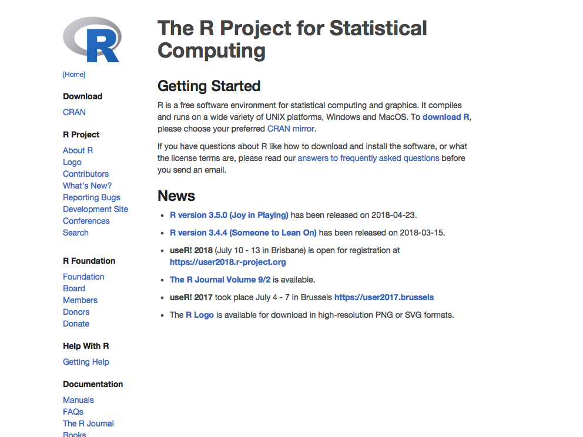
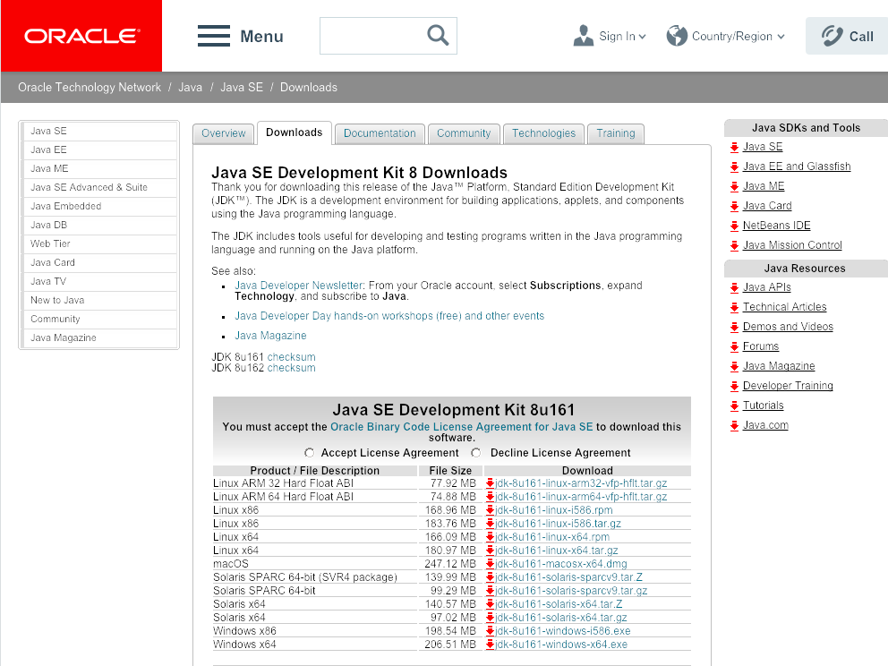
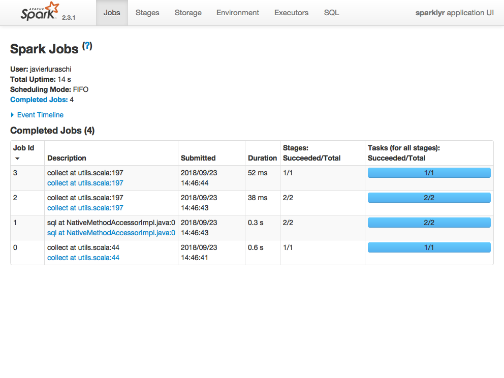

# Installation {#installation}

From R, installing and launching a local Spark cluster using `sparklyr` is as easy as running:

```{r eval=FALSE}
spark_install()
sc <- spark_connect(master = "local")
```

However, to make sure we can all run the code above and understand it, this chapter will walk you through installing the prerequisites, installing Spark and connecting to a local Spark cluster.

## Prerequisites {#prerequisites}

As briefly mentioned in the [Introduction] chapter, R is a programming language that can run in many platforms and environments. Most people making use of a programming language also choose tools to make them more productive in it; for R, RStudio would be such tool. Strictly speaking, RStudio is an Integrated Development Environment or IDE for short, which also happens to support many platforms and environments. R and RStudio are the free software tools this book will make use of and therefore, I strongly recommend you get those installed if you haven't done so already. 

Additionally, since Spark is build in the Scala programming language which is run by the Java Virtual Machine, you also need to install Java 7 or newer in your system. It is likely that your system already has Java installed, but is probably worth updating with the steps bellow.

### Install R

From [r-project.org](https://r-project.org/), download and launch the installer for your platform, Windows, Macs or Linux available.

```{r r-download, echo=FALSE, fig.width = 4, fig.align = 'center', fig.cap='The R Project for Statistical Computing.'}

```

### Install Java

From [oracle.com/technetwork/java/javase/downloads/jdk8-downloads-2133151.html](http://www.oracle.com/technetwork/java/javase/downloads/jdk8-downloads-2133151.html), download and launch the installer for your platform, Windows, Macs or Linux available. While installing the JRE (Java Runtime Environment) is sufficient for most operations, in order to build extensions you will need the JDK (Java Developer Kit); therefore, I rather recommend installing the JDK in the first place.

```{r java-download, fig.width = 4, fig.align = 'center', echo=FALSE, fig.cap='Java Download.'}

```

Starting with Spark 2.1, Java 8 is required; however, previous versions of Spark support Java 7. Regardless, we recommend installing Java 8 as described in this chapter

### Install RStudio

While installing RStudio is not strictly required to work with `sparklyr` in R, it will make you much more productive and therefore, I would recommend you take the time to install RStudio from [rstudio.com/products/rstudio/download/](https://www.rstudio.com/products/rstudio/download/), then download and launch the installer for your platform: Windows, Macs or Linux.

```{r rstudio-download, fig.width = 4, fig.align = 'center', echo=FALSE, fig.cap='RStudio Downloads.'}
knitr::include_graphics("images/02-getting-started-rstudio.png")
```

After launching RStudio, identify the Console panel since this is where most of the code will be executed in this book. For additional learning resources on R and RStudio consider visiting: [rstudio.com/online-learning/](https://www.rstudio.com/online-learning/).

### Install sparklyr

First of all, we would want to install `sparkylr`. As many other R packages, `sparklyr` is available in [CRAN](https://CRAN.R-project.org/package=sparklyr) and can be easily installed as follows:

```{r eval=FALSE}
install.packages("sparklyr")
```

The CRAN release of `sparklyr` contains the most stable version and it's the recommended version to use; however, for those that need or might want to try newer features being developed in `sparklyr` you can install directly from GitHub using the `devtools` package. First install the `devtools` package and then `sparklyr` as follows:

```{r eval=FALSE}
install.packages("devtools")
devtools::install_github("rstudio/sparklyr")
```

## Installing Spark {#installing-spark}

Start by loading `sparklyr`, 

```{r warning=FALSE, message=FALSE}
library(sparklyr)
```

This will makes all `sparklyr` functions available in R, which is really helpful; otherwise, we would have to run each `sparklyr` command prefixed with `sparklyr::`.

As mentioned, Spark can be easily installed by running `spark_install()`; this will install the latest version of Spark locally in your computer, go ahead and run `spark_install()`. Notice that this command requires internet connectivity to download Spark.

```{r eval=FALSE}
spark_install()
```

All the versions of Spark that are available for installation can be displayed with `spark_available_versions()`:

```{r}
spark_available_versions()
```

A specific version can be installed using the Spark version and, optionally, by also specifying the Hadoop version. For instance, to install Spark 1.6.3, we would run `spark_install("1.6.3")`.

You can also check which versions are installed by running:

```{r eval=FALSE}
spark_installed_versions()
```

Finally, in order to uninstall an specific version of Spark you can run `spark_uninstall()` by specifying the Spark and Hadoop versions, for instance:

```{r eval=FALSE}
spark_uninstall(version = "1.6.0", hadoop = "2.6")
```

## Connecting to Spark

It's important to mention that, so far, we've only installed a local Spark cluster. A local cluster is really helpful to get started, test code and troubleshoot with ease; further chapters will explain where to find, install and connect to real Spark clusters with many machines; but for the first few chapters, we will focus on using local clusters.

Threfore, to connect to this local cluster we simple run:

```{r message=FALSE}
sc <- spark_connect(master = "local")
```

The `master` parameter helps `sparklyr` find which is the "main" machine from the Spark cluster, this machine is often call the driver node. While working with real clusters using many machines, most machines will be worker machines and one will be the master. Since we only have a local cluster with only one machine, we will default to use `"local"` for now.

## Using Spark

Now that you are connected, we can run a simple commands. For instance, let's start by loading some text.

First, lets create a text file by running:

```{r}
write("Hello World!", "hello.txt")
```

Which we can read back in Spark by running:

```{r}
spark_read_text(sc, "hello", "hello.txt")
```

### Web Interface {#spark-web-interface}

Most of the Spark commands will get started from the R console; however, it is often the case that monitoring and analizing execution is done through Spark's web interface. This interface is a web page provided by the driver node which can be accessed from `sparklyr` by running:

```{r eval=FALSE}
spark_web(sc)
```

```{r spark-web, fig.width = 4, fig.align = 'center', echo=FALSE, fig.cap='Apache Spark Web Interface.'}
invisible(webshot::webshot(
  "http://localhost:4040/",
  "images/02-getting-started-spark-web.png",
  cliprect = "viewport"
))


```

### Logs

Another common tool is to read through the Spark logs, a log is just a text file where Spark will append information relevant to the execution of tasks in the cluster. For local clusters, we can retrieve the `sparklyr` related log entries by running:

```{r}
spark_log(sc, filter = "sparklyr", n = 5)
```

### RStudio {#using-spark-from-rstudio}

**TODO:** Explain and show a couple integration points for those using `sparklyr` from RStudio.

## Disconnecting

For local clusters and, really, any cluster; once you are done processing data you should disconnect by running:

```{r eval=FALSE}
spark_disconnect(sc)
```

this will terminate the connection to the cluster but also terminate the cluster tasks as well. If multiple Spark connections are active, or if the conneciton instance `sc` is no longer available, you can also disconnect all your Spark connections by running `spark_disconnect_all()`.

## Recap

This chapter walked you through installing R, Java, RStudio and `sparklyr` as the main tools required to use Spark from R. We covered installing local Spark clusters using `spark_install()` and learned how to launch the web interface using `spark_web(sc)` and view logs using `spark_log(sc)`.

It is my hope that this chapter will help anyone interested in learning cluster computing using Spark and R to get you started, ready to experiment on your own and ready to tackle actual data analysis and modeling tasks without any makor blockers. However, if you hit any installation or connection issues, start by browsing online for the error message or open a GitHub issue under [https://github.com/rstudio/sparklyr/issues](https://github.com/rstudio/sparklyr/issues) to help you get going.
