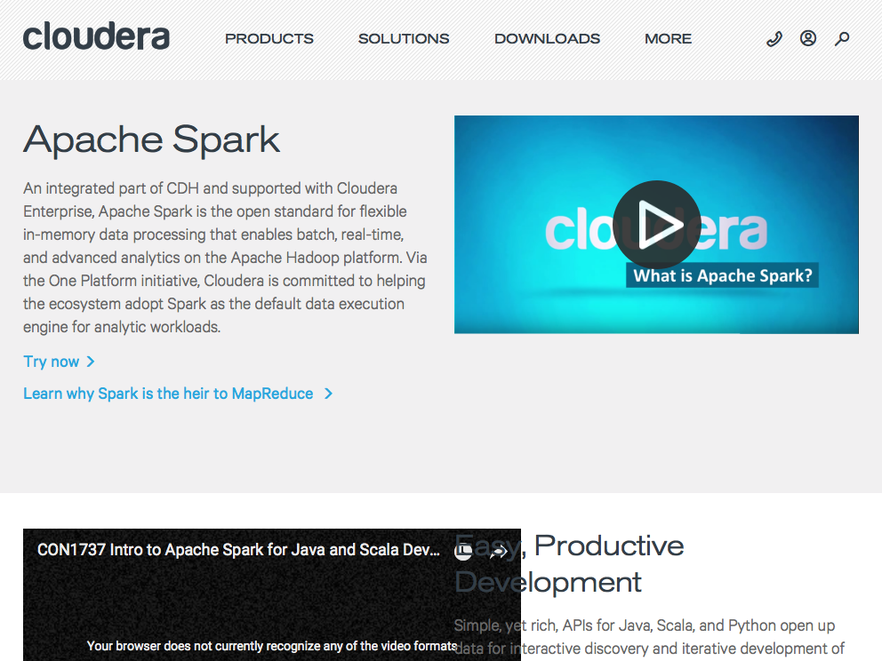
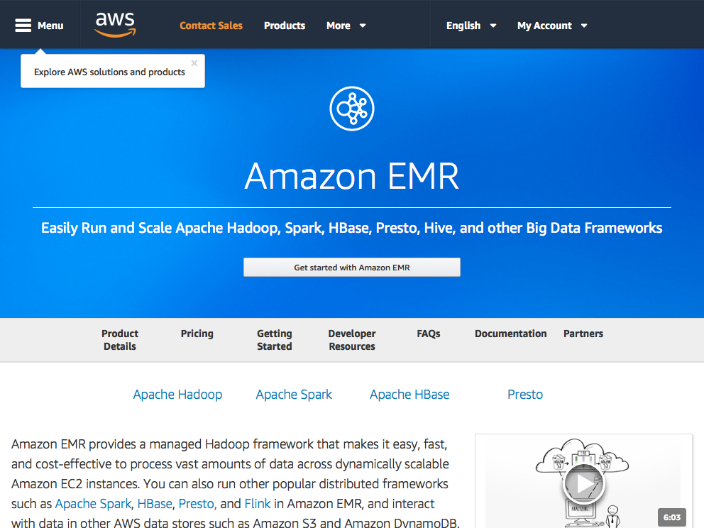

# Clusters {#clusters}

Previous chapters focused on using Spark running over a single node, your personal computer. In this chapter we will introduce techniques to run Spark over multiple machines and cluster managers.

## Overview

Most readers might already have an Spark cluster in their organization, if that's the case, you should ask your cluster administrator to provide connection information for this cluster and read carefully their usage policies and constraints. A cluster is usually shared among many users so you want to be respectful of others time and resources while using a shared cluster environment. Your system administrator will describe if it's an **on-prem** vs **cloud** cluster, the **distribution**, the cluster **manager** being used, supported **connections** and supported **tools**.

For those readers than don't have a cluster yet, it is likely that you will want to choose a cloud cluster, but reading throught this chapter will help you an overview of all the different approaches you can take to create your own cluster or decide which cluster provider to use. At the end, there is no right answer for all readers, but my hope if that this will help you take a sensible decision on which cluster provider and distribution to choose.

## On-Prem vs Cloud

First, we can start by asking where are the machines for your cluster will be located? For historical reasons, most organizations have choosen to colocate their cluster machiens with their business, as in, there is a room full of computers hosting a variety of software. More recently, software companies have made available clusters of machines available in their own data centers that one can connect to and rent. We call the former, on-premise cluster or on-prem for short and, cloud clusters or on-demand cluster for the latter one. Each have different tradeoffs worth considering.

### On-Prem

For on-premise clusters, a set of machines is managed by an organization. The machines are usually colocated with their physical location and are managed by staff usually employed by their organization. These clusters can be highly customized and controlled; however, they inccur significant initial expenses and high management costs.

**Cloudera**

```{r cloudera-spark, fig.width = 4, fig.align = 'center', echo=FALSE, fig.cap='Cloudera Landing Site.'}

```

**Hortonworks**

```{r hortonworks-spark, fig.width = 4, fig.align = 'center', echo=FALSE, fig.cap='Hortonworks Landing Site.'}
knitr::include_graphics("images/05-clusters-hortonworks-landing.png")
```

**MapR**

```{r mapr-spark, fig.width = 4, fig.align = 'center', echo=FALSE, fig.cap='MapR Landing Site.'}
knitr::include_graphics("images/05-clusters-mapr-landing.png")
```

### Cloud

For cloud clusters, the machines are rented from a cloud provider by an hourly and even by the minute or second basis. The cloud providers with highest market captical are: Amazon, Google and Microsoft.

**Amazon** provides cloud services through [Amazon Web Services](https://aws.amazon.com/); more specifically, they provide an on-demand Spark cluster through [Amazon Elastic Mad Reduce](https://aws.amazon.com/emr/) or EMR for short.


```{r amazon-emr, fig.width = 4, fig.align = 'center', echo=FALSE, fig.cap='Amazon EMR Landing Site.'}

```

**Google** provides their on-demand computing services through their [Google Cloud](https://cloud.google.com/), on-demand Spark cluster are provided by [Google Dataproc](https://cloud.google.com/dataproc/).

```{r google-dataproc, fig.width = 4, fig.align = 'center', echo=FALSE, fig.cap='Google Dataprox Landing Site.'}
knitr::include_graphics("images/05-clusters-dataproc-landing.png")
```

**Microsoft** provides cloud services thorugh [Microsft Azure](https://azure.microsoft.com/) and Spark clusters through [Azure HDInsight](https://azure.microsoft.com/en-us/services/hdinsight/).

```{r azure-hdinsight, fig.width = 4, fig.align = 'center', echo=FALSE, fig.cap='Azure HDInsight Landing Site.'}
knitr::include_graphics("images/05-clusters-azure-landing.png")
```

## Distributions

## Managers

### Standalone

### Yarn

### Mesos

### Kubernetes

## Connections

### Shell

### Livy 

## Tools

### R and RStudio
