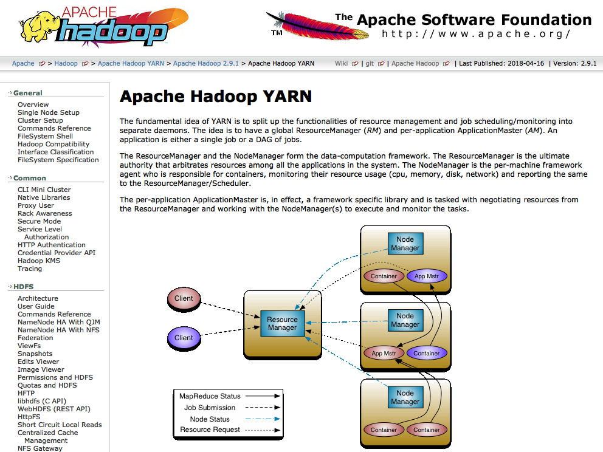
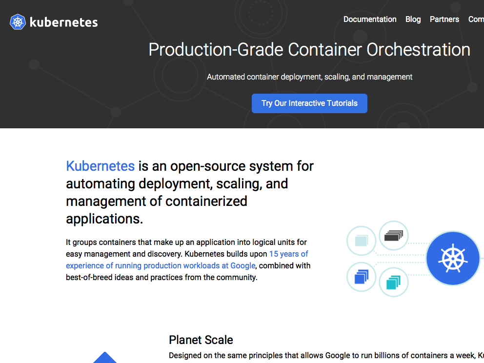
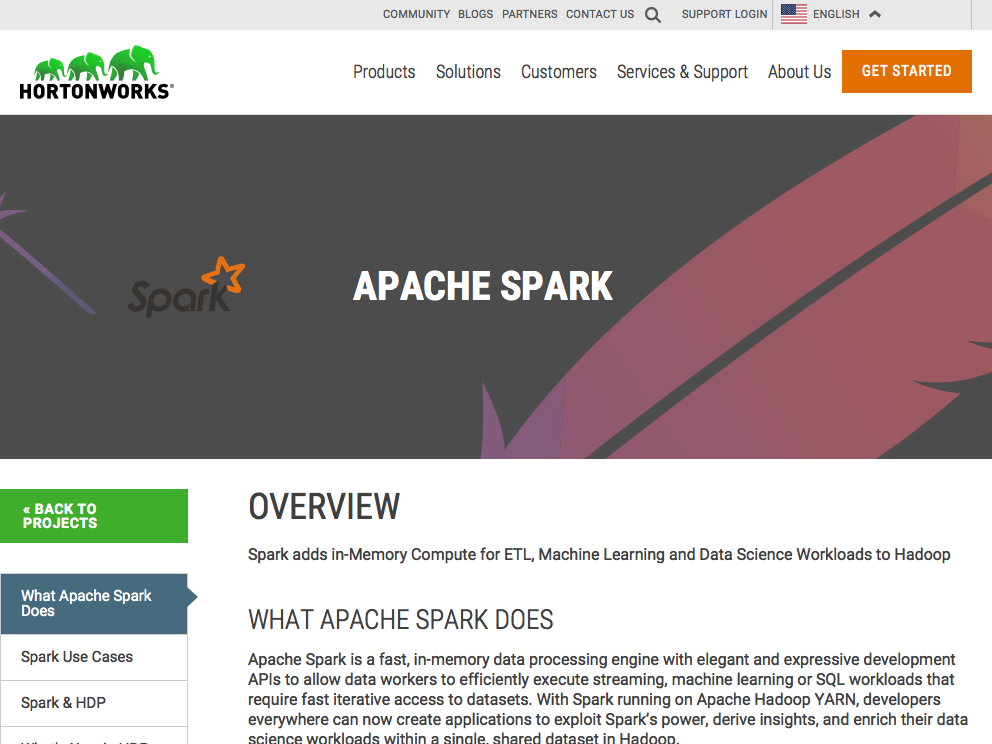
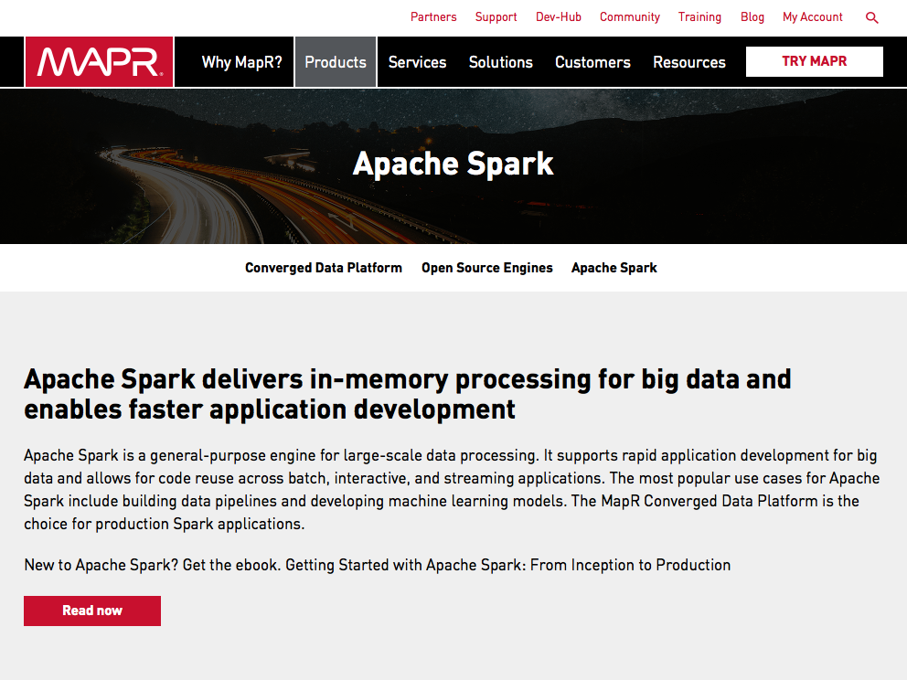
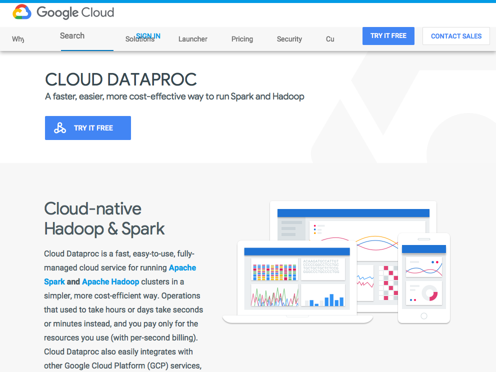
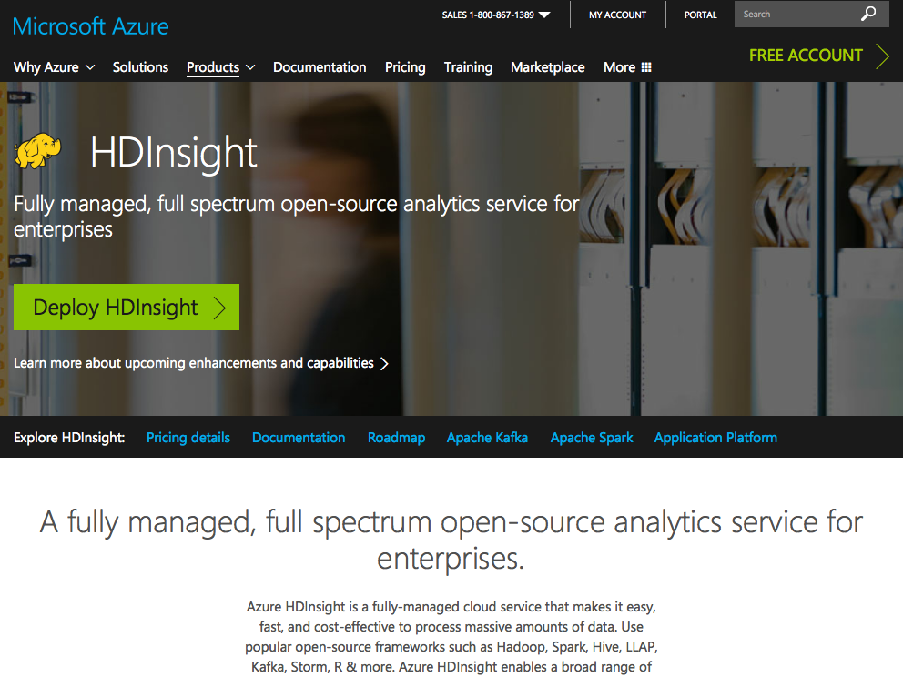
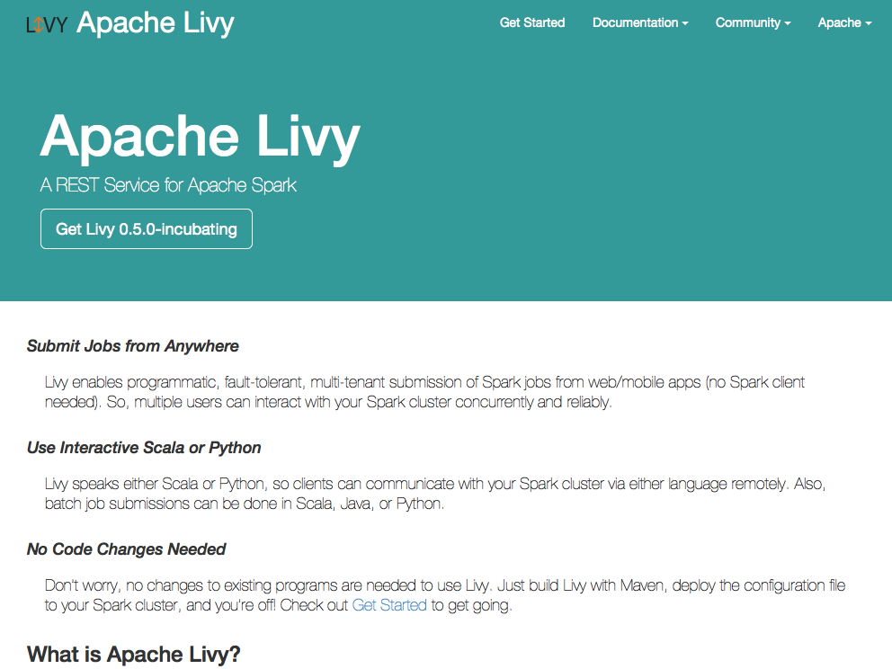

# Clusters {#clusters}

Previous chapters focused on using Spark over a single computing instance, your personal computer. In this chapter we will introduce techniques to run Spark over multiple computing instances, also known as a computing cluster, to analyze data at scale.

If you already have a Spark cluster in your organization, you could consider skipping to the next chapter, [Connections], which will teach you how to connect to an existing cluster.

If don't have a cluster or are considering improvements to your existing infrastructure, this chapter will introduce some of the cluster trends, managers and providers available today.

## Overview

There are three major trends in cluster computing worth discussing: **on-premise**, **cloud computing** and **kubernetes**. Framing these trends over time will help us understand how they came to be, what they are and what their future might be:

```{r echo=FALSE, message=FALSE, fig.align = 'center', out.width='100%', fig.cap='Google trends for on-premise (mainframe), cloud computing and kubernetes.'}
library(dplyr)
library(r2d3)

read.csv("data/05-cluster-trends.csv") %>%
  mutate(month = as.Date(paste(month, "-01", sep = ""))) %>%
  r2d3(script="images/05-clusters-trends.js")
```

For **on-premise** clusters, someone, either yourself or someone in your organiation purchased physical computers that are intended to be used for cluster computing. The computers in this cluster can made of _off-the-shelf_ hardware, meaning that someone placed an order to purchase computers usually found in stores shelves or, _high-performance_ hardware, meaning that a computing vendor provided highly customized computing hardware which also comes optimized for high-performance network connectivity, power consumption, etc. When purchasing hundreds or thousands of computing instances, it doesn't make sense to keep them in the usual computing case that we are all familiar with, but rather, it makes sense to stack them as efficient as possible on top of each other to minimize room space. This group of efficiently stacked computing instances is known as a [rack](https://en.wikipedia.org/wiki/Rack_unit). Once a cluster grows to thousands of computers, you will also need to host hundreds of racks of computing devices, at this scale, you would also need significant physical space to hosts those racks. A building that provides racks of computing instances is usually known as a _data-center_. At the scale of a data center, optimizing the building that holds them, their heating system, power suply, network connectivity, etc. becomes also relevant to optimize. In 2011, Facebook [announced](https://code.facebook.com/posts/187637061409082/building-efficient-data-centers-with-the-open-compute-project/) the [Open Compute Project](http://www.opencompute.org/) inniciative which provides a set of data center blueprints free for anyone to use.

There is nothing preventing us from building our own data centers and in fact, many organizations have followed this path. For instance, Amazon started as an online book store, over the years Amazon grew to sell much more than just books and, with it's online store growth, their data centers also grew in size. In 2002, Amazon considered [selling access to virtual servers](https://en.wikipedia.org/wiki/Amazon_Web_Services#History), in their data centers to the public and, in 2004, Amazon Web Services launched as a way to let anyone rent a subset of their datacenters on-demand, meaning that one did not have to purchase, configure, maintain nor teardown it's own clusters but could rather rent them from Amazon directly.

The on-demand compute model is what we know today as **Cloud Computing**. It's a concept that evolved from Amazon Web Services providing their data centers as a service. In the cloud, the cluster you use is not owned by you and is neither in your physical building, but rather, it's a data center owned and managed by someone else. Today, there are many cloud providers in this space ranging from Amazon, Microsoft, Google, IBM and many others. Most cloud computing platforms provide a user interface either through a web applciation and command line to request and manage resources.

While the bennefits of processing data in the _cloud_ were obvious for many years, picking a cloud provider had the unintended side-effect of locking organizations with one particular provider, making it hard to switch between provideers or back to on-premise clusters. **Kubernetes**, announced by Google in 2014, is an [open source system for managing containerized applications across multiple hosts](https://github.com/kubernetes/kubernetes/). In practice, it provides common infrastructure otherwise proprietary to cloud providers making it much easier to deploy across multiple cloud providers and on-premise as well. However, being a much newer paradigm than on-premise or cloud computing, it is still in it's adoption phase but, nevertheless, promising for cluster computing in general and, specifically, for Apache Spark.

## Managers

In order to run Spark within a computing cluster, one needs to run something capable of initializing Spark over each compute instance, this is known as a [cluster manager](https://en.wikipedia.org/wiki/Cluster_manager). The available cluster managers in Spark are: **Spark Standalone**, **YARN**, **Mesos** and **Kubernetes**.

### Standalone {#clusters-standalone}

In **Spark Standalone**, Spark works on it's own without additional software requirements since it provides it's own cluster manager as part of the Spark installation.

```{r spark-standalone, fig.width = 4, fig.align = 'center', echo=FALSE, fig.cap='Spark Standalone Site.'}
knitr::include_graphics("images/05-clusters-spark-standalone.png")
```

By completing the [Installation] chapter, you should have a local Spark installation available, which we can use to initialize a local stanalone Spark cluster. First, retrieve the `SPARK_HOME` directory by running `sparklyr::spark_home_dir()` from R and then, from a terminal or R, use `start-master.sh` and `start-slave.sh` as follows:

```{r message=FALSE, eval=FALSE}
# Retrieve the Spark installation directory
spark_home <- sparklyr::spark_home_dir()

# Build path to start-master.sh
start_master <- file.path(spark_home, "sbin", "start-master.sh")

# Execute start-master.sh to start the cluster manager master node
system2(start_master)

# Build path to start-slave
start_slave <- file.path(spark_home, "sbin", "start-slave.sh")

# Execute start-slave.sh to start a worker and register in master node
system2(start_slave, paste0("spark://", system2("hostname", stdout = TRUE), ":7077"))
```

The previous command initialized the master node and a worker node, the master node interface can be accessed under [localhost:8080](http://localhost:8080) and looks like the following:

```{r echo=FALSE, eval=FALSE}
Sys.sleep(10)
invisible(webshot::webshot(
  "http://localhost:8080/",
  "images/05-clusters-spark-standalone-web-ui.png",
  cliprect = "viewport"
))
```

```{r spark-standalone-web-ui, fig.width = 4, fig.align = 'center', echo=FALSE, fig.cap='Spark Standalone Web Interface.'}
knitr::include_graphics("images/05-clusters-spark-standalone-web-ui.png")
```

Notice that there is one worker register in Spark standalone, you can follow the link to this worker node to see additional information:

```{r echo=FALSE, eval=FALSE}
invisible(webshot::webshot(
  "http://localhost:8081/",
  "images/05-clusters-spark-standalone-web-ui-worker.png",
  cliprect = "viewport"
))
```


```{r spark-standalone-web-ui-worker, fig.width = 4, fig.align = 'center', echo=FALSE, fig.cap='Spark Standalone Worker Web Interface.'}
knitr::include_graphics("images/05-clusters-spark-standalone-web-ui-worker.png")
```

Once data analysis is complete, one can simply stop all the running nodes in this local cluster by running:

```{r message=FALSE, eval=FALSE}
stop_all <- file.path(spark_home, "sbin", "stop-all.sh")
system2(stop_all)
```

A similar approach can be followed to configure a cluster by running each `start-slave.sh` command over each machine in the cluster.

Further reading: [Spark Standalone Mode](https://spark.apache.org/docs/latest/spark-standalone.html)

### Yarn

YARN for short, or Hadoop YARN, is the resource manager introduced in 2012 to the Hadoop project. As mentioned in in the [Introduction] chapter, Spark was built initially to speed up computation over Hadoop; then, when Hadoop 2 was launched, it introduced YARN as a component to manage resources in the cluster, to this date, using Hadoop YARN with Apache Spark is still very common.

YARN applications can be submitted in two modes: **yarn-client** and **yarn-cluster**. In yarn-cluster mode the driver is running remotely, while in yarn-client mode, the driver is on the machine that started the job, `sparklyr` supports both modes.

```{r hadoop-yarn, fig.width = 4, fig.align = 'center', echo=FALSE, fig.cap='Hadoop YARN Site'}

```

Further reading: [Running Spark on YARN](https://spark.apache.org/docs/latest/running-on-yarn.html)

### Mesos

Apache Mesos is an open-source project to manage computer clusters. Mesos began as a research project in the UC Berkeley RAD Lab by then PhD students Benjamin Hindman, Andy Konwinski, and Matei Zaharia, as well as professor Ion Stoica. Mesos uses Linux [Cgroups](https://en.wikipedia.org/wiki/Cgroups) to provide isolation for CPU, memory, I/O and file system.

```{r mesos-spark, fig.width = 4, fig.align = 'center', echo=FALSE, fig.cap='Mesos Landing Site'}
knitr::include_graphics("images/05-clusters-mesos.png")
```

Further reading: [Running Spark on Mesos](https://spark.apache.org/docs/latest/running-on-mesos.html)

### Kubernetes

Kubernetes is an open-source container-orchestration system for automating deployment, scaling and management of containerized applications that was originally designed by Google and now maintained by the [Cloud Native Computing Foundation](https://www.cncf.io/).

```{r kubernetes-spark, fig.width = 4, fig.align = 'center', echo=FALSE, fig.cap='Kubernetes Landing Site.'}

```

Further reading: [Running Spark on Kubernetes](https://spark.apache.org/docs/latest/running-on-kubernetes.html)

## On-Premise

As mentioned in the overview section, on-premise clusters represent a set of computing instances procured, colocated and managed by staff members from your organization. These clusters can be highly customized and controlled; however, they can also inccur significant initial expenses and maintenance costs.

One can use a cluster manager in on-premise clusters as described in the previous section; however, many organizations choose to partner with companies providing additional management software, services and resources to manage software in their cluster including, but not limited to, Apache Spark. Some of the on-premise cluster providers include: Cloudera, Hortonworks and MapR to mention a few which will be briefly introduced.

### Cloudera

Cloudera, Inc. is a United States-based software company that provides Apache Hadoop and Apache Spark-based software, support and services, and training to business customers.

Cloudera's hybrid open-source Apache Hadoop distribution, CDH (Cloudera Distribution Including Apache Hadoop), targets enterprise-class deployments of that technology. Cloudera says that more than 50% of its engineering output is donated upstream to the various Apache-licensed open source projects (Apache Hive, Apache Avro, Apache HBase, and so on) that combine to form the Apache Hadoop platform. Cloudera is also a sponsor of the Apache Software Foundation.

```{r cloudera-spark, fig.width = 4, fig.align = 'center', echo=FALSE, fig.cap='Cloudera Landing Site.'}
knitr::include_graphics("images/05-clusters-cloudera.png")
```

### Hortonworks

Hortonworks is a big data software company based in Santa Clara, California. The company develops, supports, and provides expertise on an expansive set of entirely open source software designed to manage data and processing for everything from IOT, to advanced analytics and machine learning. Hortonworks believes it is a data management company bridging the cloud and the datacenter.

```{r hortonworks-spark, fig.width = 4, fig.align = 'center', echo=FALSE, fig.cap='Hortonworks Landing Site.'}

```

### MapR

MapR is a business software company headquartered in Santa Clara, California. MapR provides access to a variety of data sources from a single computer cluster, including big data workloads such as Apache Hadoop and Apache Spark, a distributed file system, a multi-model database management system, and event stream processing, combining analytics in real-time with operational applications. Its technology runs on both commodity hardware and public cloud computing services.

```{r mapr-spark, fig.width = 4, fig.align = 'center', echo=FALSE, fig.cap='MapR Landing Site.'}

```

## Cloud

For those readers that don't have a cluster yet, it is likely that you will want to choose a cloud cluster, this section will briefly mention some of the major cloud infrastructure providers as a starting point to choose the right one for you.

It is worth mentioning that in a cloud service model, the compute instances are charged by the hour and times the number of instances reserved for your cluster. Since the cluster size is flexible, it is a good practice to start with small clusters and scale compute resources as needed. Even if you know in advance that a cluster of significant size will be required, starting small provides an opportunity to troubleshoot issues at a lower cost since it's unlikely that your data analysis will run at scale flawlessly on the first try.

The major providers of cloud computing infrastructure are: Amazon, Google and Microsoft that this section will briefly introduce.

### Amazon

Amazon provides cloud services through [Amazon Web Services](https://aws.amazon.com/); more specifically, they provide an on-demand Spark cluster through [Amazon Elastic Map Reduce](https://aws.amazon.com/emr/) or EMR for short.

```{r amazon-emr, fig.width = 4, fig.align = 'center', echo=FALSE, fig.cap='Amazon EMR Landing Site.'}
knitr::include_graphics("images/05-clusters-amazon-emr.png")
```

### Google

Google provides their on-demand computing services through their [Google Cloud](https://cloud.google.com/), on-demand Spark cluster are provided by [Google Dataproc](https://cloud.google.com/dataproc/).

```{r google-dataproc, fig.width = 4, fig.align = 'center', echo=FALSE, fig.cap='Google Dataprox Landing Site.'}

```

### Microsoft

Microsoft provides cloud services thorugh [Microsft Azure](https://azure.microsoft.com/) and Spark clusters through [Azure HDInsight](https://azure.microsoft.com/en-us/services/hdinsight/).

```{r azure-hdinsight, fig.width = 4, fig.align = 'center', echo=FALSE, fig.cap='Azure HDInsight Landing Site.'}

```

## Tools

While using only R and Spark can be sufficient for some clusters, it is common to install complementary tools in your cluster to improve: monitoring, sql analysis, workflow coordination, etc. with applications like [Ganglia](http://ganglia.info/), [Hue](http://gethue.com/) and [Oozie](https://oozie.apache.org) respectevly. This secton is not meant to cover all, but rather mention two that are relevant to R and `sparklyr`.

### RStudio

RStudio's open source and professional products, like: RStudio Server, [RStudio Server Pro](https://www.rstudio.com/products/rstudio-server-pro/), [Shiny Server](https://www.rstudio.com/products/shiny/), [Shiny Server Pro](https://www.rstudio.com/products/shiny-server-pro/), or [RStudio Connect](https://www.rstudio.com/products/connect/); can be installed within the cluster to support many R workflows, while `sparklyr` does not require any additional tools, they provide significant productivity gains worth considering.

```{r rstudio-server, fig.width = 4, fig.align = 'center', echo=FALSE, fig.cap='Rstudio Server'}
knitr::include_graphics("images/05-clusters-rstudio-server.png")
```

### Livy {#clusters-livy}

[Apapche Livy](https://livy.incubator.apache.org/) is an incubation project in Apache providing support to use Spark clusters remotely through a web interface. It is ideal to connect directly into the Spark cluster; however, there are times where connecting directly to the cluster is not feasible. When facing those constraints, one can consider installing Livy in their cluster and secure it properly to enable remote use over web protocols.

However, there is a significant performance overhead from using Livy in `sparklyr` for experimentation, meaning that, executing many client comamnds over Livy has a significant overhead; however, running a few commands to generate complex analysis is usually performant since the performance overhead of starting computation can be insignificant compared to the actual cluster computation.

```{r apache-livy, fig.width = 4, fig.align = 'center', echo=FALSE, fig.cap='Apache Livy Landing Site.'}

```

## Recap

This chapter explained the history and tradeoffs of on-premise, cloud computing and presented Kubernetes as a promising framework to provide flexibility across on-premise and cloud providers. It also introduced cluster managers (Spark Standalone, YARN, Mesos and Kubernetes) as the software needed to run Spark as a cluster application. This chapter briefly mentioned on-premise cluster providers like Cloudera, Hortonworks and MapR as well as the major cloud providers: Amazon, Google and Microsoft.

While this chapter provided a solid foundation to understand current computing trends, cluster tools and providers useful to perform data science; it falls short to help those tasked with deliberately choosing a cluster manager, service provider or architecture. If you have this task assigned to you, use this chapter as a starting point to reach to many more resources to complete your understanding of the platform your organization needs.

The next chapter, [Connections], assumes a Spark cluster is already available to you and will focus on understanding how to connect to it from sparklyr.
