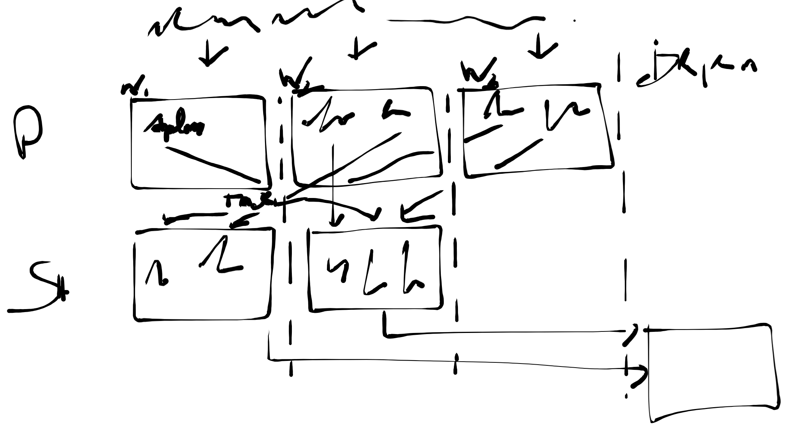

# Tuning {#tuning}

**This chatper has not been written.**

## Overview

```{r echo=FALSE, fig.align = 'center', fig.cap='Spark RDDs'}

```

```{r eval=FALSE}
sc <- spark_connect(master = "local", memory = "4g", cores = 8)

entries <- 100000000
sort_r <- system.time(runif(entries, 0, 100) %>% sort())["elapsed"]
sort_spark <- system.time(sdf_len(sc, entries) %>% dplyr::mutate(x = rand()) %>% dplyr::arrange() %>% dplyr::compute())["elapsed"]

lapply(expt(1:10))
```

## Configuration

```{r eval=FALSE}
config <- spark_config()
sc <- spark_connect(master = "local")

spark_context_config(sc)

spark_session_config(sc)

# Previous versions
spark_hive_config(sc)
```

https://spark.apache.org/docs/latest/configuration.html

## Caching

Most sparklyr operations that retrieve a Spark data frame, cache the results in-memory, for instance, running `spark_read_parquet()` or `sdf_copy_to()` will provide a Spark dataframe that is already cached in-memory. As a Spark data frame, this object can be used in most sparklyr functions, including data analysis with dplyr or machine learning.

```{r eval=FALSE}
library(sparklyr)
sc <- spark_connect(master = "local")
```

```{r eval=FALSE}
iris_tbl <- sdf_copy_to(sc, iris, overwrite = TRUE)
```

You can inspect which tables are cached by navigating to the Spark UI using `spark_web(sc)`, opening the storage tab, and clicking on a given RDD:

```{r echo=FALSE, eval=FALSE}
invisible(webshot::webshot(
  "http://localhost:4040/storage/rdd/?id=9",
  "images/07-tuning-cache-rdd-web.png",
  cliprect = "viewport"
))
```

```{r spark-standalone-rdd-web, fig.width = 4, fig.align = 'center', echo=FALSE, fig.cap='Cached RDD in Spark Web Interface.'}
knitr::include_graphics("images/07-tuning-cache-rdd-web.png")
```

Data loaded in memory will be released when the R session terminates either explicitly or implicitly with a restart or disconnection; however, to free up resources, you can use `tbl_uncache()`:

```{r eval=FALSE}
tbl_uncache(sc, "iris")
```

```{r eval=FALSE, echo=FALSE}
spark_disconnect(sc)
```

## Partitions

## Shuffling

## Checkpointing

## Troubleshooting

### Graph Visualization

```{r eval=FALSE, echo=FALSE}
library(sparklyr)
library(dplyr)

sc <- spark_connect(master = "local")
iris_tbl <- copy_to(sc, iris, repartition = 3)

iris_df <- iris_tbl %>% arrange(Sepal_Width) %>% collect()

webshot::webshot(
  "http://localhost:4040/stages/stage/?id=1&attempt=0",
  file = "images/07-tuning-spark-graph-visualization.png",
  eval = "
  casper.waitForSelector(
    '#stage-dag-viz',
    function() {
      this.click('#stage-dag-viz');
    }
  );",
  selector = c("#dag-viz-graph"))

spark_disconnect(sc)
```

```{r echo=FALSE, fig.align = 'center', fig.cap='Spark Graph Visualization'}
knitr::include_graphics("images/07-tuning-spark-graph-visualization.png")
```

### Event Timeline

One of the best ways to tune your Spark jobs is to use the Spark's [web interface](spark-web-interface), click on the job being diagnosed, then the stage and then expand the **event timeline**.

Lets the take a look at the event timeline for the ordering a data frame by a given column using three partitions:

```{r eval=FALSE, echo=FALSE}
library(sparklyr)
library(dplyr)
```

```{r eval=FALSE}
spark_connect(master = "local") %>%
  copy_to(iris, repartition = 3) %>%
  arrange(Sepal_Width)
```

```{r eval=FALSE, echo=FALSE}
webshot::webshot(
  "http://localhost:4040/stages/stage/?id=1&attempt=0",
  file = "images/07-tuning-spark-event-timeline.png",
  eval = "
  casper.waitForSelector(
    '#task-assignment-timeline',
    function() {
      this.click('.expand-task-assignment-timeline');
    }
  );",
  selector = c(".legend-area", "#task-summary-table"))

spark_disconnect(sc)
```

```{r echo=FALSE, fig.align='center', out.width='90%', fig.cap='Spark Event Timeline'}
knitr::include_graphics("images/07-tuning-spark-event-timeline.png")
```

## Recap
