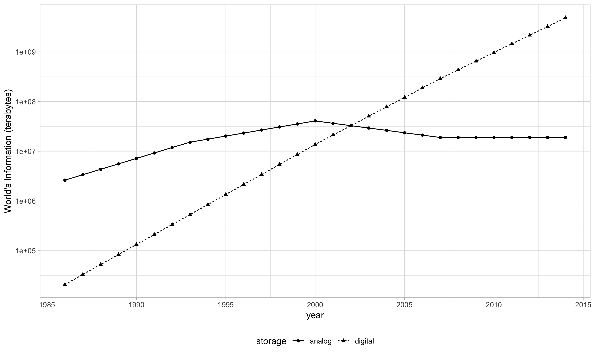
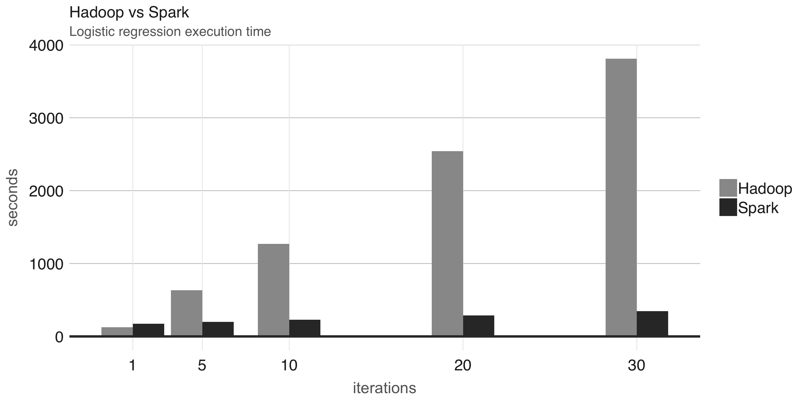
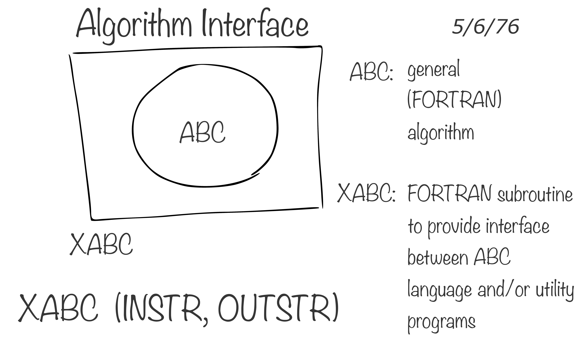
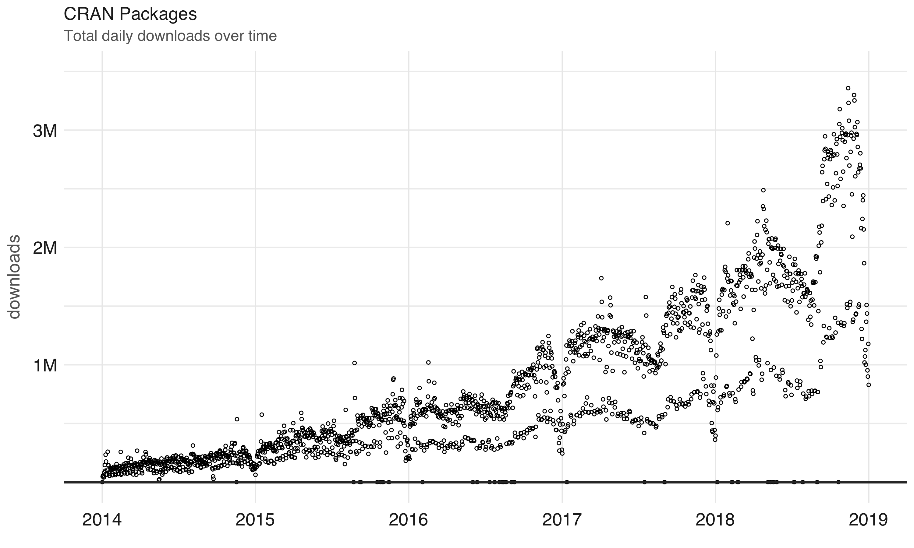

\mainmatter

```{r include=FALSE, eval=TRUE}
knitr::opts_chunk$set(eval = FALSE)
source("r/render.R")
```

# Introduction {#intro}

This chapter covers the historical background that lead to the development of Apache Spark, introduces R in the context of Spark and [sparklyr](https://github.com/rstudio/sparklyr) as a project bridging Spark and R.

## Background {#intro-background}

As humans, we have been storing, retrieving, manipulating, and communicating information since the Sumerians in Mesopotamia developed writing in about 3000 BC. Based on the storage and processing technologies employed, it is possible to distinguish four distinct phases of development: pre-mechanical (3000 BC – 1450 AD), mechanical (1450–1840), electromechanical (1840–1940), and electronic (1940–present)[@information-technology].

Mathematician George Stibitz used the word **digital** to describe fast electric pulses back in 1942[@computing-concise-history] and, to this day, we describe information stored electronically as digital information. In contrast, **analog** information is defined as, not digital and it represents everything we have stored by any non-electronic means such as: hand written notes, books, newspapers and so on[@webster2006merriam].

The world bank report on digital development provides an estimate of digital and analog information stored over the last decades[@data-revolution]. This report found out that digital information surpassed analog information around 2003, at that time, there were aboput 10M terabytes of digital information, which is roughly about 10M computer drives today. However, a more relevant finding from this report was that our footprint of digital information is growing at [exponential rates](#appendix-storage-capacity):

```{r message=FALSE, warning=FALSE, echo=FALSE, fig.cap='World’s capacity to store information.', fig.align = 'center'}
suppressMessages(library(tidyverse))
read_csv("data/01-worlds-capacity-to-store-information.csv", skip = 8) %>%
  gather(key = storage, value = capacity, analog, digital) %>%
  mutate(year = X1, terabytes = capacity / 10^12) %>%
  ggplot(aes(x = year, y = terabytes, group = storage)) +
    geom_line(aes(linetype = storage)) +
    geom_point(aes(shape = storage)) +
    scale_y_log10(
      breaks = scales::trans_breaks("log10", function(x) 10^x),
      labels = scales::trans_format("log10", scales::math_format(10^.x))
    ) +
    scale_y_log10(name="World's Information (terabytes)") +
    theme_light() +
    theme(legend.position = "bottom") +
    ggsave("images/intro-world-store-capacity.png", width = 10, height = 6)
```


With the ambition to provide tools capable of searching all this new digital information, many companies attempted to provide such functionality with what we know today as search engines, used when searching the web. Given the vast amount of digital information, managing information at this scale was a challenging problem. Search engines were unble to store all the web page information required to support web searches in a single computer. This meant that they had to split information across many machines, which was accomlished by splitting this data and storing it as many files across many machines. This approach became known as the Google File System from a research paper published in 2003 by Google[@google-file-system].

One year later, in 2004, Google published a new paper describing how to perform operations across the Google File System, this approach came to be known as **MapReduce**[@google-map-reduce]. As you would expect, there are two operations in MapReduce: Map and Reduce. The **map operation** provides an arbitrary way to transform each file into a new file, usually defined by arbitrary code that scans the file and outputs a different file. The **reduce operation** combines two files into a new one. These two operations are sufficient to process data at the scale of the data available in the web.

For example, we can use MapReduce to count words in two different text files. The mapping operation splits each word in the original file and outputs a new word-counting file with a mapping of words and counts. The reduce operation can be defined to take two word-counting files and combine them by aggregating the totals for each word, this last file will contain a list of word counts across all the original files.

```{r eval=TRUE, echo=FALSE, fig.cap='Simple MapReduce Example.'}
render_nomnoml("
#spacing: 80
#direction: right
#zoom: 4
[Alice's File|I like apples]
[Bob's File|I like bananas]

[Alice's File]-Map[Alice's Words]
[Bob's File]-Map[Bob's Words]

[Alice's Words|I,1|like,1|apples,1]
[Bob's Words|I,1|like,1|bananas,1]

[Alice's Words]- Reduce[Word Counts]
[Bob's Words]- Reduce[Word Counts]

[Word Counts|I,2|like,2|apples,1|bananas,1]
", "images/intro-simple-map-reduce-example.png", "Simple MapReduce Example.")
```

Counting words is often the most basic MapReduce example, but it can be also used for much more sophisticated and interesting applications. For instance, MapReduce can be used to rank web pages in Google's **PageRank** algorithm, which assigns ranks to web pages based on the count of hyperlinks linking to a web page and the rank of the page linking to it.

After these papers were released by Google, a team in Yahoo worked on implementing the Google File System and MapReduce as a single open source project. This project was released in 2006 as **Hadoop** with the Google File System implemented as the Hadoop File System, or **HDFS** for short. The Hadoop project made distributed file-based computing accessible to a wider range of users and organizations which enabled them to make use of MapReduce beyond web data processing.

While Hadoop provided support to perform MapReduce operations over a distributed file system, it still required MapReduce operations to be written with code every time a data analysis was run. To improve over this tedious process, the **Hive** project released in 2008 by Facebook, brought Structured Query Language (**SQL**) support to Hadoop. This meant that data analysis could now be performed at large-scale without the need to write code for each MapReduce operation; instead, one could write generic data analysis statements in SQL that are much easier to understand and write.

## Spark {#intro-spark}

In 2009, **Apache Spark** starts as a research project at the UC Berkeley's AMPLab to improve over MapReduce. Specifically, by providing a richer set of verbs beyond MapReduce that facilitate optimizing code running in multiple machines and, by loading data in-memory which made operations much fasters than Hadoop's on-disk storage. One of the earliest results showed that running logistic regression, a data modeling technique that will be introduced under the [modeling](#modeling) chapter, allowed Spark to run 10x faster than Hadoop by making use of in-memory datasets[@zaharia2010spark].


```{r echo=FALSE}
iterations <- c(1, 1:6 * 5)
data.frame(
  iteration = rep(iterations, 2),
  cluster = c(rep("hadoop", length(iterations)), rep("spark", length(iterations))),
  seconds = c(iterations * 127, 174 + (iterations - 1) * 6)) %>%
  ggplot(aes(x=iteration, y=seconds, fill=cluster)) +
  geom_bar(stat="identity", position=position_dodge()) +
  labs(x = "Number of Iterations", y = "Running Time (s)") +
  theme_light() +
  ggsave("images/intro-hadoop-spark-logistic-regression.png", width = 10, height = 4)
```


While Spark is well known for its in-memory performance, Spark was designed to be a general execution engine that works both in-memory and on-disk. For instance, Spark holds [records in large-scale sorting](http://sortbenchmark.org/), where data was not loaded in-memory; but rather, Spark made use of improvements in network serialization, network shuffling and efficient use of the CPU's cache to dramatically improve performance. For comparison, one can [sort 100TB of data in 72min and 2100 computers using Hadoop, but only 206 computers in 23min using Spark](https://databricks.com/blog/2014/11/05/spark-officially-sets-a-new-record-in-large-scale-sorting.html), it's also the case that [Spark holds the record in the cloud sorting benchmark ](https://spark.apache.org/news/spark-wins-cloudsort-100tb-benchmark.html), which makes Spark the most cost effective solution for large-scale sorting.

|                  | Hadoop Record | Spark Record  |
|------------------|---------------|---------------|
| Data Size        | 102.5 TB      | 100 TB        |
| Elapsed Time     | 72 mins       | 23 mins       |
| Nodes            | 2100          | 206           |
| Cores            | 50400         | 6592          |
| Disk             | 3150 GB/s     | 618 GB/s      |
| Network          | 10Gbps        | 10Gbps        |
| Sort rate        | 1.42 TB/min   | 4.27 TB/min   |
| Sort rate / node | 0.67 GB/min   | 20.7 GB/min   |

In 2010, Spark was released as an open source project and then donated to the Apache Software Foundation in 2013. Spark is licensed under the [Apache 2.0](https://en.wikipedia.org/wiki/Apache_License), which allows you to freely use, modify, and distribute it. In 2015, Spark reaches more than 1000 contributors, making it one of the most active projects in the Apache Software Foundation.

This gives an overview of how Spark came to be, which we can now use to formally introduce Apache Spark as follows:

> "Apache Spark is a fast and general engine for large-scale data processing."
>
> --- [spark.apache.org](http://spark.apache.org/)

To help us understand this definition of Apache Spark, we will break it down as follows:

- **Data Processing**: Data processing is the collection and manipulation of items of data to produce meaningful information[@data-processing].
- **General**: Spark optimizes and executes parallel generic code, as in, there are no restrictions as to what type of code one can write in Spark.
- **Large-Scale**: One can interpret this as **cluster**-scale, as in, a set of connected computers working together to accomplish specific goals.
- **Fast**: Spark is much faster than its predecessor by making efficient use of memory, network and CPUs to speed data processing algorithms in computing cluster.

Since Spark is _general_, you can use Spark to solve many problems, from calculating averages to approximating the value of Pi, [predicting customer churn](https://mapr.com/blog/churn-prediction-sparkml/), [aligning protein sequences](https://academic.oup.com/gigascience/article/7/8/giy098/5067872) or analyzing [high energy physics at CERN](https://db-blog.web.cern.ch/blog/luca-canali/2017-08-apache-spark-and-cern-open-data-example).

Describing Spark as _large_ _scale_ implies that a good use case for Spark is tackling problems that can be solved with multiple machines. For instance, when data does not fit in a single disk driver or does not fit into memory, Spark is a good candidate to consider.

Since Spark is _fast_, it is worth considering for problems that may not be large-scale, but where using multiple processors could speed up computation. For instance, sorting large datasets or CPU intensive models could also bennefit from running in Spark.

Therefore, Spark is good at tackling large-scale data processing problems, this usually known as **big data** ([data sets that are more voluminous and complex that traditional ones](https://en.wikipedia.org/wiki/big_data)), but also is good at tackling large-scale computation problems, known as **big compute** ([tools and approaches using a large amount of CPU and memory resources in a coordinated way](https://www.nimbix.net/glossary/big-compute/)). 

Big data and big compute problems are usually easy to spot, if the data does not fit into a single machine, you might have a big data problem; if the data fits into a single machine but a process over the data takes days, weeks or even months to compute, you might have a big compute problem.

However, there is also a third problem space where data nor compute are necessarily large-scale and yet, there are significant benefits from using Spark. For this third problem space, there are a few use cases this breaks to:

1. **Velocity**: One can have a dataset of 10GB in size and a process that takes 30min to run over this data, this is by no means big-compute nor big-data; however, if a data scientist is researching ways to improve accuracy for their models, reducing the runtime down to 3min it's a 10X improvement, this improvement can lead to significant advances and productivity gains by increasing the velocity at which one can analyze data.

2. **Variety**: One can have an efficient process to collect data from many sources into a single location, usually a database, this process could be already running efficiently and close to realtime. Such processes are known at ETL (Extract-Transform-Load); data is extracted from multiple sources, transformed to the required format and loaded in a single data store. While this has worked for years, the tradeoff from this system is that adding a new data source is expensive, the system is centralized and tightly controlled. Since making changes to this type of systems could cause the entire process to come to a halt, adding new data sources usually takes long to be implemented. Instead, one can store all data its natural format and process it as needed using cluster computing, this architecture is currently known as a [data lake](https://en.wikipedia.org/wiki/Data_lake).

Some people refer to some of these benefits as [the four 'V's of big data](http://www.theserverside.com/feature/Handling-the-four-Vs-of-big-data-volume-velocity-variety-and-veracity): Velocity, Variety, Volume and Veracity (which asserts that data can vary greatly in quality which require analysis methods to improve accuracy across a variety of sources). Others have gone as far as expending this to [five](https://en.wikipedia.org/wiki/Big_data) or even as [the 10 Vs of Big Data](https://tdwi.org/articles/2017/02/08/10-vs-of-big-data.aspx). Mnemonics set aside, cluster computing is being used today in more innovative ways and and is not uncommon to see organizations experimenting with new workflows and a variety of tasks that were traditionally uncommon for cluster computing. Much of the hype attributed to big data falls into this space where, strictly speaking, one is not handling big data but there are still beneffits from using tools designed for big data and big compute. My hope is that this book will help you understand the opportunities and limitations of cluster computing, and specifically, the opportunities and limitations from using Apache Spark with R.

## R {#intro-r}

R is a computing language with it's inception dating back to Bell Laboratories. R was not created at Bell Labs, but it's predecesor, the S computing language was. [Rick Becker explained in useR 2016](https://blog.revolutionanalytics.com/2016/07/rick-becker-s-talk.html) that at that time in Bell Labs, computing was done by calling subroutines written in the Fortran language which, apparently, were not pleasant to deal with. The S computing language was designed as an interface language to solve particular problems without having to worry about other languages, Fortran at that time. The creator of S, [John Chambers](https://en.wikipedia.org/wiki/John_Chambers_(statistician)), describes how S was designed to provide an interface through the following diagram:

```{r s-diagram, echo = FALSE, fig.cap = 'Interface language diagram by John Chambers - Rick Becker useR 2016.', fig.align = 'center'}

```


R is a modern and free implementation of S, specifically:

> R is a programming language and free software environment for statistical computing and graphics.
>
> --- [The R Project for Statistical Computing](https://www.r-project.org/)

While working with data, I believe there are two strong arguments for using R:

- The **R Language** was designed by statisticians for statisticians, meaning, this is one of the few successful languages designed for non-programmers; so learning R will probably feel more natural. Additionally, since the R language was designed to be an interface to other tools and languages, R allows you to focus more on modeling and less on peculiarities of computer science and engineering.
- The **R Community** provides a rich package archive provided by CRAN ([The Comprehensive R Archive Network](https://cran.r-project.org/)) which allows you to install ready-to-use packages to perform many tasks, most notably, high-quality statistic models with many only available in R. In addition, the R community is a welcoming and active group of talented individuals motivated to help you succeed. Many packages provided by the R community make R, by far, the place to do statistical computing. To mention some of the popular packages: [dplyr](https://CRAN.R-project.org/package=dplyr) to manipulate data, [cluster](https://CRAN.R-project.org/package=cluster) to analyze clusters and [ggplot2](https://CRAN.R-project.org/package=ggplot2) to visualize data. We can quantify the [growth of the R community](#appendix-cran-downloads) by plotting daily downloads of R packages in CRAN.

```{r message=FALSE, warning=FALSE, echo=FALSE, fig.cap='Daily downloads of CRAN packages.', fig.align = 'center'}
downloads_csv <- "data/01-intro-r-cran-downloads.csv"
if (!file.exists(downloads_csv)) {
  downloads <- cranlogs::cran_downloads(from = "2014-01-01", to = "2018-01-01")
  readr::write_csv(downloads, downloads_csv)
}

cran_downloads <- readr::read_csv(downloads_csv)

ggplot(cran_downloads, aes(date, count / 10^6)) + 
  geom_point(colour="black", pch = 21, size = 1) +
  scale_x_date() +
  xlab("Year") +
  ylab("Daily Downloads (millions)") +
  theme_light() +
  ggsave("images/intro-daily-cran-downloads.png", width = 10, height = 6)
```


Aside from statistics, R is also used in many other fields, the following ones are particularily relevant to this book:

- **Data Science**: An exciting discipline that allows you to turn raw data into understanding, insight, and knowledge[@r-for-data-science]. In 1997, C.F. Jeff Wu advocated that statistics be renamed data science[@statisticsisdatascience]; however, in 2001, William S. Cleveland introduced data science as an independent discipline extending the field of statistics to incorporate "advances in computing with data"[@datascienceindependent].
- **Machine Learning**: Field of artificial intelligence that uses statistical techniques to give computer systems the ability to "learn" from data. Arthur Samuel coined the term "machine learning" in 1959 while designing programs to play checkers using alpha-beta prunning[@samuel1959some]. Machine learning is employed in computing tasks where designing explicit algorithms is difficult; for example, email filtering, detection of network intruders, and computer vision.
- **Deep Learning**: A field of machine learning where models are vaguely inspired in biological nervous systems. In 2006, Geoffrey E. Hinton overcomed the vanishing-gradient-problem in deep neural networks by pre-training one layer at a time[@hinton2006fast]. In 2012, convolutions and GPUs were introduced by Alex Krizhevsky  making them the best image classification model over ImageNet[@krizhevsky2012imagenet].

While working in any of the previous fields, you might be faced with increasingly large datasets or increasingly complex computations, that are slow to execute or at times, even impossible to complete. When faced with this challenge, the following techniques are usually effective:
- **Sampling:**
- **Profiling:**
- **Scaling Up:**
- **Scaling Out:**

## sparklyr {#intro-sparklyr}

Back in 2016, there was a need in the R community to support Spark through an R package that would provide an interface compatible with other R packages, easy to use and available in CRAN. To this end, development of `sparklyr` started in 2016 by RStudio under [JJ Allaire](https://github.com/jjallaire), [Kevin Ushey](https://github.com/kevinushey) and [Javier Luraschi](https://github.com/javierluraschi), version [0.4 was released](https://blog.rstudio.com/2016/09/27/sparklyr-r-interface-for-apache-spark/) in summer during the _useR!_ conference, this first version added support for `dplyr`, `DBI`, modeling with `MLlib` and an extensible API that enabled extensions like [H2O](https://www.h2o.ai/)'s [rsparkling](https://github.com/h2oai/rsparkling/) package. Since then, many new features and improvements have been made available through [sparklyr 0.5](https://blog.rstudio.com/2017/01/24/sparklyr-0-5/), [0.6](https://blog.rstudio.com/2017/07/31/sparklyr-0-6/), [0.7](https://blog.rstudio.com/2018/01/29/sparklyr-0-7/), [0.8](https://blog.rstudio.com/2018/05/14/sparklyr-0-8/) and [0.9](https://blog.rstudio.com/2018/10/01/sparklyr-0-9/).

Officially,

> `sparklyr` is an R interface for Apache Spark.
>
> --- [github.com/rstudio/sparklyr](https://github.com/rstudio/sparklyr)

It's available in CRAN and works like any other CRAN package, meaning that: it's agnostic to Spark versions, it's easy to install, it serves the R community, it embraces other packages and practices from the R community and so on. It's hosted in GitHub under [github.com/rstudio/sparklyr](https://github.com/rstudio/sparklyr) and licensed under Apache 2.0 which is allows you to clone, modify and [contribute back](#contributing) to this project.

While thinking of who and why should use `sparklyr`, the following roles come to mind:

- **New Users**: For new users, `sparklyr` provides the easiest way to get started with Spark. My hope is that the first chapters of this book will get you up running with ease and set you up for long term success.
- **Data Scientists**: For data scientists that already use and love R, `sparklyr` integrates with many other R practices and packages like `dplyr`, `magrittr`, `broom`, `DBI`, `tibble` and many others that will make you feel at home while working with Spark. For those new to R and Spark, the combination of high-level workflows available in `sparklyr` and low-level extensibility mechanisms make it a productive environment to match the needs and skills of every data scientist.
- **Expert Users**: For those users that are already immersed in Spark and can write code natively in Scala, consider making your libraries available as an `sparklyr` [custom extension](#contributing-r-extension) to the R community, a diverse and skilled community that can put your contributions to good use while moving [open science](https://en.wikipedia.org/wiki/Open_science) forward.

This book is titled "The R in Spark" as a way to describe and teach that area of overlap between Spark and R. The R package that represents this overlap is `sparklyr`; however, the overlap goes beyond a package. It's an overlap of communities, expectations, future directions, packages and package extensions as well. Naming this book `sparklyr` or "Introduction to sparklyr" would have left behind a much more exciting opportunity, an opportunity to present this book as an intersection of the R and Spark communities. Both are solving very similar problems with a set of different skills and backgrounds; therefore, it is my hope that `sparklyr` can be a fertile ground for innovation, a welcoming place to newcomers, a productive place for experienced data scientists and an open community where cluster computing and modeling can come together.
