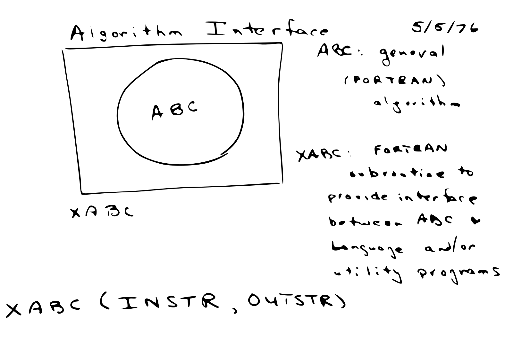

```{r include=FALSE}
knitr::opts_chunk$set(eval = FALSE)
knitr::opts_chunk$set(warning = FALSE)
```

# Introduction

## Overview

Humanity footprint of digital information grows at exponential rates:

```{r message=FALSE, eval=TRUE, echo=FALSE, fig.align = 'center', fig.cap='World’s capacity to store information.'}
suppressMessages(library(tidyverse))
read_csv("../data/01-worlds-capacity-to-store-information.csv", skip = 8) %>%
  gather(key = storage, value = capacity, analog, digital) %>%
  mutate(year = X1, terabytes = capacity / 1e+12) %>%
  ggplot(aes(x = year, y = terabytes, group = storage)) +
    geom_line(aes(linetype = storage)) +
    geom_point(aes(shape = storage)) +
    scale_y_log10(
      breaks = scales::trans_breaks("log10", function(x) 10^x),
      labels = scales::trans_format("log10", scales::math_format(10^.x))
    ) +
    theme_light() +
    theme(legend.position = "top")
```

Hadoop used disks across machines to process map/reduce operations.

## Spark

> "Apache Spark is a fast and general engine for large-scale data processing."

> - **Data Processing**: Data processing is the collection and manipulation of items of data to produce meaningful information.
> - **General**: Spark optimizes and executes parallel generic code, as in, there are no restrictions as to what type of code one can write in Spark.
> - <div class="highlight">**Large-Scale**:</div> One can interpret this as cluster-scale, as in, a set of connected computers working together to accomplish specific goals.
> - <div class="highlight">**Fast**:</div> Spark is much faster than its predecessor by making efficient use of memory to speed data access while running algorithms at scale.

<div class="fragment spaced">
This is usually known as <div class="highlight">**Big Data**</div> or <div class="highlight">**Big Compute.**</div>
</div>
## R Language

> R is a programming language and free software environment for statistical computing and graphics.

```{r eval=TRUE, echo = FALSE, fig.cap = 'Interface language diagram by John Chambers from useR 2016.', fig.align = 'center', out.width=500, out.height=300}

```

## R Community

Provides a rich package archive provided in [CRAN](https://cran.r-project.org/) and [Bioconductor](https://www.bioconductor.org/): [dplyr](https://CRAN.R-project.org/package=dplyr) to manipulate data, [cluster](https://CRAN.R-project.org/package=cluster) to analyze clusters,  [ggplot2](https://CRAN.R-project.org/package=ggplot2) to visualize data, etc.

```{r eval=TRUE, message=FALSE, echo=FALSE, fig.cap='Daily downloads of CRAN packages.', fig.align='center'}
downloads_csv <- "../data/01-intro-r-cran-downloads.csv"
if (!file.exists(downloads_csv)) {
  downloads <- cranlogs::cran_downloads(from = "2014-01-01", to = "2018-01-01")
  readr::write_csv(downloads, downloads_csv)
}

cran_downloads <- readr::read_csv(downloads_csv)

ggplot(cran_downloads, aes(date, count)) + 
  geom_point(colour="black", pch = 21, size = 1) +
  scale_x_date() +
  xlab("") +
  ylab("") +
  theme_light()
```

## sparklyr: R interface for Apache Spark

```{r echo=FALSE, message=FALSE}
library(sparklyr)                                    # Load sparklyr
library(dplyr)                                       # Load dplyr
library(DBI)                                         # Load DBI

dir.create("input")                                  # Create cars folder
write.csv(mtcars, "input/cars.csv")                  # Write data in R
```

<div class="sparklyr-code">
<div>
```{r}
spark_install()                                      # Install Apache Spark
sc <- spark_connect(master = "local")                # Connect to Spark cluster
```
</div>
<div class="fragment">
```{r}
cars_tbl <- spark_read_csv(sc, "cars", "input/")     # Read data in Spark

summarize(cars_tbl, n = n())                         # Count records with dplyr
dbGetQuery(sc, "SELECT count(*) FROM cars")          # Count records with DBI
```
</div>
<div class="fragment">
```{r}
ml_linear_regression(cars_tbl, mpg ~ wt + cyl)       # Perform linear regression

ml_pipeline(sc) %>%                                  # Define Spark pipeline
  ft_r_formula(mpg ~ wt + cyl) %>%                   # Add formula transformation
  ml_linear_regression()                             # Add model to pipeline
```
</div>
<div class="fragment">
```{r}
spark_context(sc) %>% invoke("version")              # Extend sparklyr with Scala
```
</div>
<div class="fragment">
```{r}
spark_apply(cars_tbl, nrow)                          # Extend sparklyr with R
```
</div>
<div class="fragment">
```{r}
stream_read_csv(sc, "input/") %>%                    # Define Spark stream
  filter(mpg > 30) %>%                               # Add dplyr transformation
  stream_write_json("output/")                       # Start processing stream
```
</div>
</div>

# Modeling

## Algorithms

Modeling algorithms supported in `sparklyr`:

<div class="compactTable">
Algorithm | Function
----------|---------
Accelerated Failure Time Survival Regression | ml_aft_survival_regression()
Alternating Least Squares Factorization | ml_als()
Bisecting K-Means Clustering | ml_bisecting_kmeans()
Chi-square Hypothesis Testing | ml_chisquare_test()
Correlation Matrix | ml_corr()
Decision Trees | ml_decision_tree	()
Frequent Pattern Mining | ml_fpgrowth()
Gaussian Mixture Clustering | ml_gaussian_mixture()
Generalized Linear Regression | ml_generalized_linear_regression()
Gradient-Boosted Trees | ml_gradient_boosted_trees()
Isotonic Regression | ml_isotonic_regression()
K-Means Clustering | ml_kmeans()
Latent Dirichlet Allocation | ml_lda()
Linear Regression | ml_linear_regression()
Linear Support Vector Machines | ml_linear_svc()
Logistic Regression | ml_logistic_regression()
Multilayer Perceptron | ml_multilayer_perceptron()
Naive-Bayes | ml_naive_bayes()
One vs Rest | ml_one_vs_rest()
Principal Components Analysis | ml_pca()
Random Forests | ml_random_forest()
Survival Regression | ml_survival_regression()
</div>

## Transformers

<div class="compactTable">
Transformer | Function
------------|---------
Binarizer | ft_binarizer()
Bucketizer | ft_bucketizer()
Chi-Squared Feature Selector | ft_chisq_selector()
Vocabulary from Document Collections | ft_count_vectorizer()
Discrete Cosine Transform  | ft_discrete_cosine_transform()
Transformation using dplyr | ft_dplyr_transformer()
Hadamard Product | ft_elementwise_product()
Feature Hasher | ft_feature_hasher()
Term Frequencies using Hashing | export(ft_hashing_tf)
Inverse Document Frequency | ft_idf()
Imputation for Missing Values | export(ft_imputer)
Index to String | ft_index_to_string()
Feature Interaction Transform | ft_interaction()
Rescale to [-1, 1] Range | ft_max_abs_scaler()
Rescale to [min, max] Range | ft_min_max_scaler()
Locality Sensitive Hashing | ft_minhash_lsh()
Converts to n-grams | ft_ngram()
Normalize using the given P-Norm | ft_normalizer()
One-Hot Encoding | ft_one_hot_encoder()
Feature Expansion in Polynomial Space | ft_polynomial_expansion()
Maps to Binned Categorical Features | ft_quantile_discretizer()
SQL Transformation | ft_sql_transformer()
Standardizes Features using Corrected STD | ft_standard_scaler()
Filters out Stop Words | ft_stop_words_remover()
Map to Label Indices | ft_string_indexer()
Splits by White Spaces | export(ft_tokenizer)
Transform Word into Code | ft_word2vec()
</div>

## Gaussian Mixture Clustering

```{r echo=FALSE}
devtools::install_github("hadley/fueleconomy")

library(sparklyr)
sc <- spark_connect(master = "local", version = "2.3.0")
vehicles_tbl <- copy_to(sc, fueleconomy::vehicles, overwrite = TRUE)

predictions <- vehicles_tbl %>%
  ml_gaussian_mixture(~ hwy + cty, k = 3) %>%
  ml_predict() %>%
  collect()

saveRDS(predictions, "../data/03-gaussian-mixture-prediction.rds")
```
```{r}
predictions <- copy_to(sc, fueleconomy::vehicles) %>%
  ml_gaussian_mixture(~ hwy + cty, k = 3) %>%
  ml_predict() %>% collect()

predictions %>%
  ggplot(aes(hwy, cty)) +
  geom_point(aes(hwy, cty, col = factor(prediction)), size = 2, alpha = 0.4) + 
  scale_color_discrete(name = "", labels = paste("Cluster", 1:3)) +
  labs(x = "Highway", y = "City") + theme_light()
```
```{r eval=TRUE, echo=FALSE, fig.cap="Fuel economy data for 1984-2015 from the US EPA"}
predictions <- readRDS("../data/03-gaussian-mixture-prediction.rds")
predictions %>%
  ggplot(aes(hwy, cty)) +
  geom_point(aes(hwy, cty, col = factor(prediction)), size = 2, alpha = 0.4) + 
  scale_color_discrete(name = "", labels = paste("Cluster", 1:3)) +
  labs(x = "Highway", y = "City") +
  theme_light()
```

## Broom

Turn your `sparklyr` models into data frames using the `broom` package:

```{r echo=FALSE}
library(sparklyr)
library(dplyr)
sc <- spark_connect(master = "local", version = "2.3.0")
cars_tbl <- spark_read_csv(sc, "cars", "input/")
model <- cars_tbl %>% ml_linear_regression(mpg ~ wt + cyl)
tidy_model <- list(
  broom::tidy(model),
  broom::glance(model),
  collect(broom::augment(model, cars_tbl))
)
saveRDS(tidy_model, "../data/03-broom-examples.rds")
```
```{r eval=TRUE, echo=FALSE}
tidy_model <- readRDS("../data/03-broom-examples.rds")
```
```{r}
model <- cars_tbl %>%
  ml_linear_regression(mpg ~ wt + cyl)

# Turn a model object into a data frame
broom::tidy(model)
```
```{r eval=TRUE, echo=FALSE}
tidy_model[[1]]
```
```{r}
# Construct a single row summary
broom::glance(model)
```
```{r eval=TRUE, echo=FALSE}
tidy_model[[2]]
```
```{r}
# Augments each observation in the dataset with the model
broom::augment(model, cars_tbl)
```

# Extensions

## RSparkling

[rsparkling](https://github.com/h2oai/rsparkling) provies [H2O](https://www.h2o.ai/) support in Spark using `sparklyr`:

```{r echo=FALSE}
library(rsparkling)
library(sparklyr)
library(h2o)

sc <- spark_connect(master = "local", version = "2.1.0")
cars_tbl <- sdf_copy_to(sc, mtcars, "mtcars")

cars_h2o <- as_h2o_frame(sc, mtcars_tbl, strict_version_check = FALSE)

model <- h2o.glm(x = c("wt", "cyl"), y = "mpg", training_frame = cars_h2o, lambda_search = TRUE)
saveRDS(model, "../data/08-extensions-h2o-glm.rds")
```
```{r}
library(rsparkling)
library(sparklyr)
library(h2o)

cars_h2o <- as_h2o_frame(sc, cars_tbl, strict_version_check = FALSE)
h2o.glm(x = c("wt", "cyl"), y = "mpg", training_frame = mtcars_h2o, lambda_search = TRUE)
```
```{r eval=TRUE, echo=FALSE}
readRDS("../data/08-extensions-h2o-glm.rds")
```

## GraphFrames

[GraphFrames](https://graphframes.github.io/) provides graph algorithms: PageRank, ShortestPaths, etc.

```{r echo=FALSE}
library(ggraph)
library(igraph)
library(graphframes)
library(sparklyr)
library(dplyr)

sc <- spark_connect(master = "local", version = "2.1.0")
highschool_tbl <- sdf_copy_to(sc, ggraph::highschool, "highschool", overwrite = TRUE)
highschool_tbl <- highschool_tbl %>% filter(year == 1957)

from_tbl <- highschool_tbl %>% distinct(from) %>% transmute(id = from)
to_tbl <- highschool_tbl %>% distinct(to) %>% transmute(id = to)

vertices_tbl <- from_tbl %>% sdf_bind_rows(to_tbl)
edges_tbl <- highschool_tbl %>% transmute(src = from, dst = to)

model <- gf_graphframe(vertices_tbl, edges_tbl) %>%
  gf_pagerank(reset_prob = 0.15, max_iter = 10L)

highschool_tbl %>% collect() %>%
  saveRDS("../data/08-extensions-graphframes-highschool.rds")
```
```{r}
gf_graphframe(vertices_tbl, edges_tbl) %>% gf_pagerank(reset_prob = 0.15, max_iter = 10L)
```
```
GraphFrame
Vertices:
  $ id       <dbl> 12, 12, 59, 59, 1, 20, 20, 45, 45, 8, 8, 9, 9, 26, 26, 37, 37, 47, 47, 16, 16, 71, 71, ...
  $ pagerank <dbl> 0.0058199702, 0.0058199702, 0.0000000000, 0.0000000000, 0.1500000000, 0.0344953402, 0.0...
Edges:
  $ src    <dbl> 13, 13, 13, 13, 13, 13, 13, 13, 13, 13, 13, 13, 13, 13, 13, 13, 58, 58, 58, 58, 58, 58, 5...
  $ dst    <dbl> 22, 22, 22, 22, 22, 22, 22, 22, 22, 22, 22, 22, 22, 22, 22, 22, 65, 65, 65, 65, 65, 65, 6...
  $ weight <dbl> 0.0625, 0.0625, 0.0625, 0.0625, 0.0625, 0.0625, 0.0625, 0.0625, 0.0625, 0.0625, 0.0625, 0...
```
```{r eval=TRUE, echo=FALSE, warning=FALSE, message=FALSE, fig.cap='Highschool ggraph dataset with pagerank highlighted.', fig.align='center', out.width=480, out.height=320}
library(ggraph)
library(igraph)
highschool_rdf <- readRDS("../data/08-extensions-graphframes-highschool.rds")
highschool_rdf %>% graph_from_data_frame() %>%
  ggraph(layout = 'kk') + 
    geom_edge_link(alpha = 0.1) + 
    geom_node_point(size = 2, alpha = 0.4) + theme_light() +
    annotate("point", x = -1.18, y = -3.55, size = 3) +
    annotate("point", x = 6.25, y = 2.85, size = 3) + xlab("") + ylab("")
```

## Mleap

[Mleap](https://github.com/rstudio/mleap) enables Spark pipelines in production.

```{r}
# Create pipeline
pipeline_model <- ml_pipeline(sc) %>%
  ft_binarizer("hp", "big_hp", threshold = 100) %>%
  ft_vector_assembler(c("big_hp", "wt", "qsec"), "features") %>%
  ml_gbt_regressor(label_col = "mpg") %>%
  ml_fit(cars_tbl)

# Perform predictions
predictions_tbl <- ml_predict(pipeline_model, mtcars_tbl)

# Export model with mleap
ml_write_bundle(pipeline_model, predictions_tbl, "mtcars_model.zip")
```

Use model outside Spark and productions systems. For instance, in <span class="javaHighlight">Java:</span>

<div class="java">
```{java}
import ml.combust.mleap.runtime.MleapContext;

// Initialize
BundleBuilder bundleBuilder = new BundleBuilder();
MleapContext context = (new ContextBuilder()).createMleapContext();
Bundle<Transformer> bundle = bundleBuilder.load(new File(request.get("mtcars_model.zip")), context);

// Read into Mleap DataFrame
DefaultLeapFrame inputLeapFrame = new DefaultLeapFrame();

// Perform Mleap transformation
DefaultLeapFrame transformedLeapFrame = bundle.root().transform(inputLeapFrame).get();
```
</div>

# Thank You!

## Resources

- <div class="highlight">[therinspark.com](http://therinspark.com):</div> If you are new to Spark, this (incomplete) **booklet** will help you get up and running.
- <div class="highlight">[spark.rstudio.com](https://spark.rstudio.com):</div> This should be your entry point to learn more about sparklyr, the **documentation** is kept up to date with examples, reference functions and many more relevant resources.
- <div class="highlight">[github.com/rstudio/sparklyr](https://github.com/rstudio/sparklyr):</div> If you believe something needs to get fixed, open a **GitHub** issue or send us a pull request.
- <div class="highlight">[stackoverflow.com/tags/sparklyr](https://stackoverflow.com/tags/sparklyr):</div> For general questions, **Stack Overflow** is a good place to start.
- <div class="highlight">[gitter.im/rstudio/sparklyr](https://gitter.im/rstudio/sparklyr):</div> For urgent issues or to keep in touch you can chat with us in **Gitter**.
