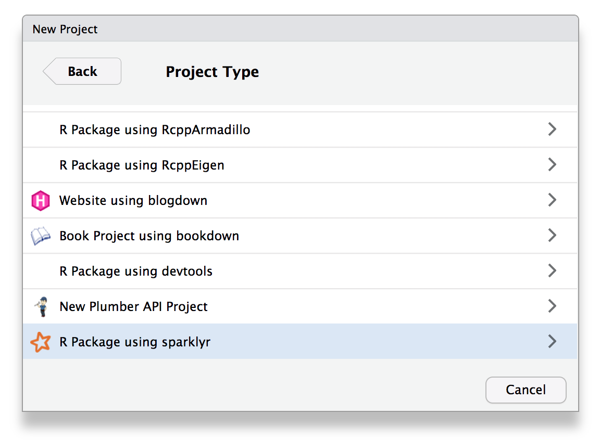

# Writting Extensions {#custom-extensions}

See [spark.rstudio.com/extensions](http://spark.rstudio.com/extensions/).

## RStudio Projects

You can create an `sparklyr` extension with ease from RStudio. This feature requires RStudio 1.1 or newer and the `sparklyr` package to be installed. Then, from the `File` menu, `New Project...`, select `R Packag using sparklyr`:



## Troubleshooting

We can trace all the calls made to `invoke()`, `invoke_new()` and `invoke_static()` using the `sparklyr.invoke.trace` and `sparklyr.invoke.trace.callstack` options as follows:

```{r eval=FALSE}
config <- spark_config()
config$sparklyr.invoke.trace <- TRUE

spark_connect(master = "local", config = config)
```
